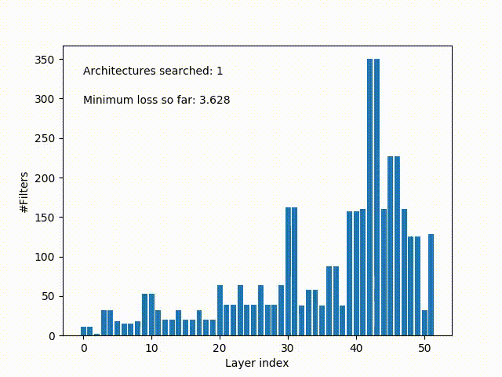

# [Towards Efficient Model Compression via Learned Global Ranking](https://arxiv.org/abs/1904.12368)

This is the code for our CVPR 2020 Oral paper [Towards Efficient Model Compression via Learned Global Ranking](https://arxiv.org/abs/1904.12368).
This work improves upon our pre-print [Layer-compensated Pruning for Resource-constrained Convolutional Neural Networks](https://arxiv.org/abs/1810.00518), in both further understanding and empirical results. A 4-page abridged version of the pre-print was accepeted as contributed talk at [NeurIPS'18 MLPCD2 Workshop](https://sites.google.com/view/nips-2018-on-device-ml/schedule?authuser=0).

## Requirements

- PyTorch 1.0.1
- Python 3.5+

## Checkpoints for pre-trained models

- [ResNet56 for CIFAR10](https://cmu.box.com/s/ngev32b97gv7vf4fpb73lxqlfzj643ib)
- [ResNet56 for CIFAR100](https://cmu.box.com/s/5gqfq4yhstzl2ygmpihujknsfbm19fj2)
- [MobileNetV2 for CIFAR100](https://cmu.box.com/s/8d9gsuo2il2wxvfg4z9spxje774izj1g)

## Running LeGR / MorphNet / AMC

The scripts for reproducing the results in Table 1 and Figure 2 are under scripts/

Within each script, there are several commands that run the experiments

P.S. For MorphNet, we search for the trade-off lambda instead of use a large lambda and grow because we find that the growing phase leads to worse results, which is also observed by Wang et al. in their CVPR work [Growing a brain: Fine-tuning by increasing model capacity](https://www.ri.cmu.edu/wp-content/uploads/2017/06/yuxiongw_cvpr17_growingcnn.pdf)

## Visualizing the search progress of affine transformations

We provide a script to extract the progress (in architectures explored) when learning the affine transformation. For any LeGR script you run, pass the generated output for searching the affine transformation to the following script will generate a visualization of the search progress

For example:

`python utils/plot_search_progress.py log/resnet56_cifar10_flops0.47_transformations_1_output.log resnet56_cifar10_flops0.47_transformations_1.mp4`

The video will be generated at `./resnet56_cifar10_flops0.47_transformations_1.mp4`

## Citation

If you find this repository helpful, please consider citing our work

    @inproceedings{chin2020legr,
    title={Towards Efficient Model Compression via Learned Global Ranking},
    author={Chin, Ting-Wu and Ding, Ruizhou and Zhang, Cha and Marculescu, Diana},
    booktitle={Proceedings of the IEEE Conference on Computer Vision and Pattern Recognition},
    year={2020}
    }

    @article{chin2018lcp,
    title={Layer-compensated pruning for resource-constrained convolutional neural networks},
    author={Chin, Ting-Wu and Zhang, Cha and Marculescu, Diana},
    journal={arXiv preprint arXiv:1810.00518},
    year={2018}
    }

    
